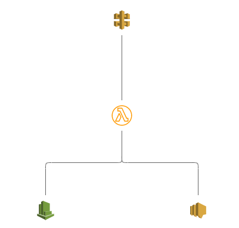

# Cloudguard Workload - Serverless Demo

Written by Michael Braun


<p align="left">
    
</p>    


This document outlines how integrate Cloudguard Workloads with the Serverless framework in a CI/CD pipeline. For this demonstration, I've written a simple Lambda function which accepts input, parses the data, and emails it back to you. Here is a logical diagram of the Lambda function: <br>



This function is deployed through Github Actions. During the deployment, the function is scanned by Proact. Proact will examine the function and alert if there are any issues with the configuration. Secondly, Github Actions then deploys the function and adds the FSP (Function Self Protect) layer. FSP is the run time protection for the Lambda function.

<b> Get started by forking this repository! </b>

## Prerequisites

In order to run this demo, you need the following:

[Github Account](https://github.com) <br>
[AWS Account](https://aws.amazon.com) with API keys <br>
[Check Point Cloud Security Posture Management Account](https://dome9.com/) with API keys<bt>

## Check Point CSPM Onboarding

For this demo to work, you need to have your AWS account onboarded to Check Point CSPM. <b> Serverless Protection needs to be enabled. </b> The build will fail if these two requirements are not met. <br><br>

I've written an onboarding script to simplify this process. Clone your repository and navigate to the /scripts directory. Install the requirements.

```
pip install -r requirements.txt
```

Then run onboard.py. here is the sample output:

```
python onboard.py
Dome9 API Key: <enter API key here>
Dome9 Secret Key: <enter API Secret here>
AWS Access Key: <enter API key here>
AWS Secret Key: <enter API Secret here>
Select option:


        1. Onboard AWS Account and Enable Serverless
        2. Enable Serverless on AWS Account

Select a task number: 1
Friendly name of AWS account for Dome9: 
working . . .
Added Sucessfully
Serverless Protection Stage 1 Complete
Starting Stage 2. This will take some time.
Serverless Protection Stage 2 Complete.
Cloudguard ID: 
Finished!
```

## Prep the Github Environment

First go to Settings > Secrets and populate the secrets: <br>


AWS_ACCESS_KEY_ID<br>
AWS_SECRET_ACCESS_KEY<br>
CG_TOKEN - <br>
<b> This must be in the format API_KEY:AP_SECRET</b> <br>
EMAIL - Email to send output to <br><br>

Second, select the "Actions" tab and enable workflows.

## Run the build

To deploy this function to AWS, modifiy the _build_flag and commit the changes. This kicks off the Github Action. This will deploy the function. Once the build is finished, you will then see it in Check Point CSPM

### Sync Check Point CSPM

In the event you do not see the function 
To Run:<br>
Onboard AWS account (you can use onboard.py)<br>
Modify _build_flag <br>
Run activity.py to test <br>
<br>
For synchronization: <br>
curl -X POST https://api.dome9.com/v2/cloudaccounts/{id}/SyncNow \
  --basic -u <key-id>:<key-secret> \
  -H 'Accept: application/json'<br><br>

To destroy: <Br>
Modify _destroy_flag<br>
