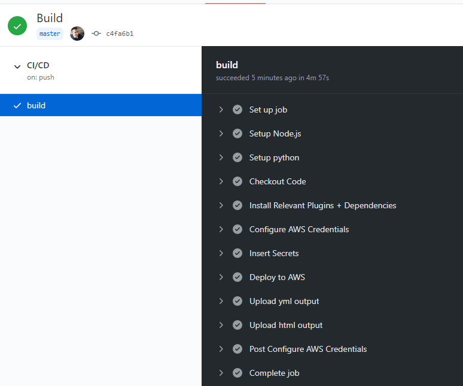
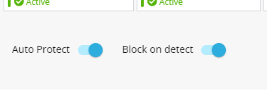
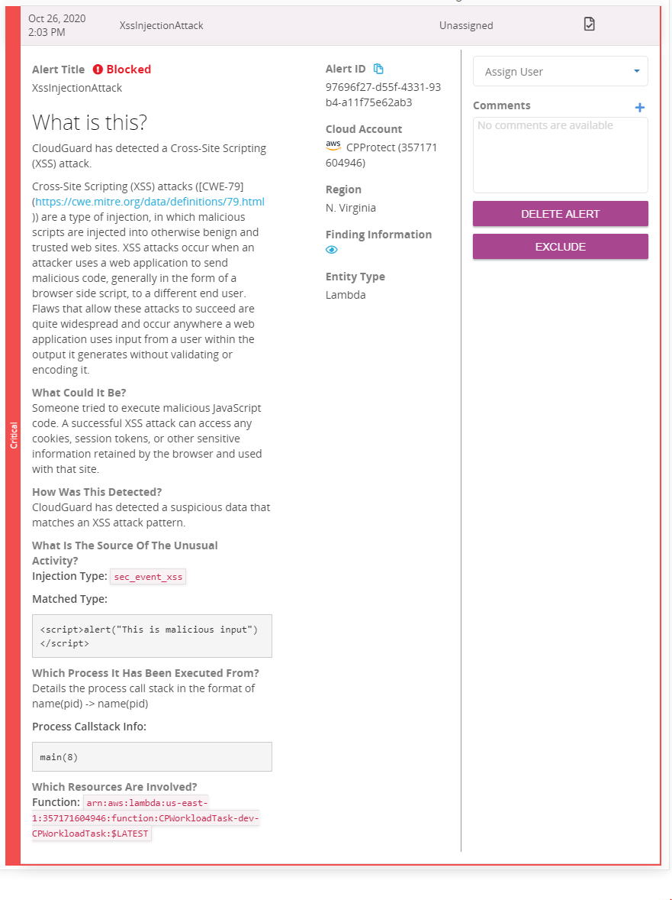

# Cloudguard Workload - Serverless Demo

Written by Michael Braun


<p align="left">
    
</p>    


This document outlines how integrate Cloudguard Workloads with the Serverless framework in a CI/CD pipeline. For this demonstration, I've written a simple Lambda function which accepts input, parses the data, and emails it back to you. Here is a logical diagram of the Lambda function: <br>


This function is deployed through Github Actions. During the deployment, the function is scanned by Proact. Proact will examine the function and alert if there are any issues with the configuration. Secondly, Github Actions then deploys the function and adds the FSP (Function Self Protect) layer. FSP is the run time protection for the Lambda function.

<b> Get started by forking this repository! </b>

## Prerequisites

In order to run this demo, you need the following:

[Github Account](https://github.com) <br>
[AWS Account](https://aws.amazon.com) with API keys <br>
[Check Point Cloud Security Posture Management Account](https://dome9.com/) with API keys<br>

<br>
To run the onboarding script, you must also have Python3.

## Check Point CSPM Onboarding

For this demo to work, you need to have your AWS account onboarded to Check Point CSPM. <b> Serverless Protection needs to be enabled. </b> The build will fail if these two requirements are not met. <br><br>

I've written an onboarding script to simplify this process. Clone your repository and navigate to the /scripts directory. Install the requirements.

```
pip install -r requirements.txt
```

Then run onboard.py. here is the sample output:

```
λ python onboard.py
Dome9 API Key: <enter API key here>
Dome9 Secret Key: <enter API Secret here>
AWS Access Key: <enter API key here>
AWS Secret Key: <enter API Secret here>
Select option:


        1. Onboard AWS Account and Enable Serverless
        2. Enable Serverless on AWS Account

Select a task number: 1
Friendly name of AWS account for Dome9: 
working . . .
Added Sucessfully
Serverless Protection Stage 1 Complete
Starting Stage 2. This will take some time.
Serverless Protection Stage 2 Complete.
Cloudguard ID: 
Finished!
```

## Prep the Github Environment

First go to Settings > Secrets and populate the secrets: <br>


AWS_ACCESS_KEY_ID<br>
AWS_SECRET_ACCESS_KEY<br>
CG_TOKEN - <b>Note: This must be in the format DOME9_API_KEY:DOME_API_SECRET</b> <br>
EMAIL - Email to send output to <br><br>

Second, select the "Actions" tab and enable workflows.

## Run the Build

To deploy this function to AWS, modifiy the _build_flag and commit the changes. This kicks off the Github Action. This will deploy the function. Once the build is finished, you will then see it in Check Point CSPM<br>



Expand the "Deploy to AWS" tab and scroll to the bottom. You will see the Proact scan. Also, the results of the scan have been uploaded as artifacts. Note the API gateway address. This will be used for testing<br>


### Sync to Check Point CSPM

Depending on when you build your function in relation to the sync interval it may take some time for the information to appear. If you would like to force this synchronization, you can run the following command: <br><br>

```
curl -X POST https://api.dome9.com/v2/cloudaccounts/<CLOUDGUARD_ACCOUNT_ID/SyncNow  --basic -u DOME9_API_KEY:DOME_API_SECRET  -H 'Accept: application/json'
```

## Check Point CSPM

Open Check Point CSPM and navigate to the "Serverless" option. Select "Serverless Assets" and click on the function "CPWorkloadTask-dev-CPWorkloadTask". This is what you will see: <br><br>


To enable the FSP to Auto Protect and Block on Detect, enable to two sliders. <br><br>



<b>Note: In order for this to take effect you must modify the _build_flag and commit the changes again. The blocking will take effect on the next build. It does not apply immediately. </b>

## Testing the function

First, confirm you have received the request from Amazon SNS. You must confirm the subscription. You may need to look in the your Junk Mail folder. <br><br>

To test the function, navigate back to the /scripts directory and run activity.py.

```
λ python scripts\activity.py
Target: https://0trz58j17h.execute-api.us-east-1.amazonaws.com/dev/main.lambda_handler
Enter your message here: This is a test message!
<Response [200]>
```

You will receive an email from AWS SNS that contains the text provided. 

### Malicious Input

You can also test putting in malicious input. Here is an example:

```
λ python scripts\activity.py
Target: https://0trz58j17h.execute-api.us-east-1.amazonaws.com/dev/main.lambda_handler
Enter your message here: <script>alert("This is malicious input")</script>
<Response [200]>
```

This function is simple and will respond to any request with a 200 code. However, you will notice that you don't get receive the email. This is because FSP stopped the function from processing. You will also see an alert in Check Point CSPM. <br><br>



## Clean up

To remove this Lambda function, modify the _destroy_flag and commit the changes. This will remove the CPWorkloadTask-dev-CPWorkloadTask function from AWS.
